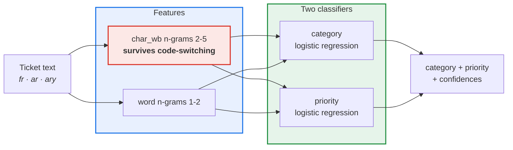

<div align="center">

# ticket-triage

**A multilingual ITSM ticket classifier — French, Arabic, Darija — trained entirely on synthetic data. CPU only.**

[](https://github.com/novagiosAI/ticket-triage/actions/workflows/ci.yml)
[](https://pypi.org/project/ticket-triage/)
[](https://pypi.org/project/ticket-triage/)
[](LICENSE)
[](https://peps.python.org/pep-0561/)

*Trains in under a minute. 0.5 MB model. No GPU, no API key, no customer data.*

</div>

---

## What it does

```bash
$ ticket-triage predict "l vpn kat9ta3, ghir l pc dyali, machi musta3jel"
category : network.vpn  (60%)
priority : 1  (58%)

$ ticket-triage predict "تظهر الطابعة رسالة انحشار الورق. جميع الموظفين متوقفون. الأمر عاجل"
category : hardware.printer  (79%)
priority : 5  (55%)
```

Same topic, opposite priorities — and the model got there by reading *"only my
PC, not urgent"* versus *"all staff are stopped, it's urgent"*, in two different
languages. That is the whole trick, and the section below shows how it was
measured rather than asserted.

## Results

Trained on 9000 synthetic tickets, tested on 1430 held-out ones:

| task | accuracy | macro-F1 | majority baseline | from topic alone |
|---|---|---|---|---|
| category | 1.000 | 1.000 | 0.228 | — |
| **priority** | **0.901** | 0.885 | 0.406 | 0.513 |

| language | n | category | priority |
|---|---|---|---|
| Arabic | 259 | 1.000 | 0.954 |
| Darija | 358 | 1.000 | 0.894 |
| French | 813 | 1.000 | 0.887 |

**Read those numbers with the three caveats below**, not without them.

### 1. The category score is not an achievement

100% looks like a result and is not. The seven categories use disjoint
vocabulary by construction — *VPN*, *imprimante*, *mot de passe* — so a linear
model separates them perfectly. It holds on deduplicated, never-seen text, so it
is not memorisation; the task is simply easy. Read it as *"the pipeline works
end to end"*, nothing more.

### 2. The priority score is the real one, and it is measured against topic

Priority is where a classifier can actually be useful, and where it can also
cheat: VPN tickets skew high-priority, printer tickets skew low, so a model that
only recognises the topic already scores **0.513**. This one scores **0.901** —
the 0.39 on top comes from reading how many people are affected and how soon it
matters.

That baseline was not free. An earlier version of the generator sampled urgency
and impact but wrote the body from the category alone, so the text carried no
severity at all. A model trained on it scored **0.469 against a 0.508 majority
baseline** — worse than guessing. The fix was in the data, not the model:
[`glpi-testkit`](https://github.com/novagiosAI/glpi-testkit) now phrases severity
the way users do.

### 3. Train and test overlap unless you force them apart

The generator draws from a finite template set, so unique texts saturate:

| tickets drawn | unique texts | diversity |
|---:|---:|---:|
| 500 | 289 | 58% |
| 8000 | 1871 | 23% |
| 20000 | 3068 | 15% |

Different random seeds are **not** a split. Measured at 9000/3000, most of the
test batch had been seen verbatim in training. `train_test_split` therefore
deduplicates by default — and you can see the inflated numbers yourself with
`deduplicate=False`.

Even deduplicated, a test ticket is a *template sibling* of a training one: same
sentence pattern, different slot values. So this measures generalisation across
slot values, not across writing styles.

### What that adds up to

**These figures will not transfer to your service desk.** They establish that
the pipeline trains, that it reads severity rather than just topic, and that it
does so equally well in three languages. Getting a number that means something
for your tickets means fine-tuning on your tickets.

## Installation

```bash
pip install ticket-triage
```

## Use it

```bash
ticket-triage train -n 12000 --report artifacts/metrics.json
ticket-triage evaluate
ticket-triage predict "Impossible de se connecter au VPN, tout le site est bloqué"
ticket-triage predict - --json < ticket.txt
ticket-triage sample -n 5
```

```python
from ticket_triage import TicketTriageModel, train_test_split, evaluate

train, test = train_test_split(12000, seed=42)
model = TicketTriageModel.train(train.texts, train.categories, train.priorities)

print(evaluate(model, test, train).to_dict())
print(model.predict("الطابعة معطلة في الطابق الثالث"))
model.save("artifacts/model.joblib")
```

## The public demo

```bash
pip install -e ".[demo]"
ticket-triage train
python app.py
```

A Gradio page: paste a ticket in any of the three languages, get a category, a
priority and the runners-up. It states its own limitations on the page, because
a demo that implies more than it delivers costs more credibility than it earns.

Deploys to a Hugging Face Space on the free CPU tier — the model is 0.5 MB.

## Why not a transformer



Three constraints decide it:

- **No GPU**, on whatever server the client already has. This trains in 50
  seconds on a laptop CPU and the artifact is 0.5 MB.
- **Code-switching.** A Moroccan ticket mixes Darija in Arabic script, Darija in
  Latin letters, French and English — sometimes in one sentence. Word features
  fragment across that; character n-grams see `imprim` in *imprimante* and
  `طابع` in `الطابعة` as ordinary substrings either way. The per-language table
  above is what that buys.
- **The data is synthetic**, which bounds what any model can learn from it.
  Spending a transformer's compute on template text buys accuracy on the
  templates.

Swapping in a transformer means replacing `model.py` and nothing else — the CLI,
the evaluation and the demo talk to `TicketTriageModel` only.

## Privacy

**No customer ticket was used at any point.** Every training example comes from
[`glpi-testkit`](https://github.com/novagiosAI/glpi-testkit), whose templates are
committed in plain sight. There is no source dataset, so there is nothing to
leak — which is what makes both the model and this repository publishable.

If you need to clean a *real* export before working on it, see
[`glpi-anonymizer`](https://github.com/novagiosAI/glpi-anonymizer) and
[`presidio-mena`](https://github.com/novagiosAI/presidio-mena).

## Contributing

See [CONTRIBUTING.md](CONTRIBUTING.md).

```bash
git clone https://github.com/novagiosAI/ticket-triage.git
cd ticket-triage
python -m venv .venv && source .venv/bin/activate   # Windows: .venv\Scripts\activate
pip install -e ".[dev]"
pytest
```

## License

[Apache License 2.0](LICENSE) — free for commercial use.

---

<div align="center">

Built and maintained by **[Novagios](https://www.novagios.com)** — IT services, AI and ITSM.

</div>
